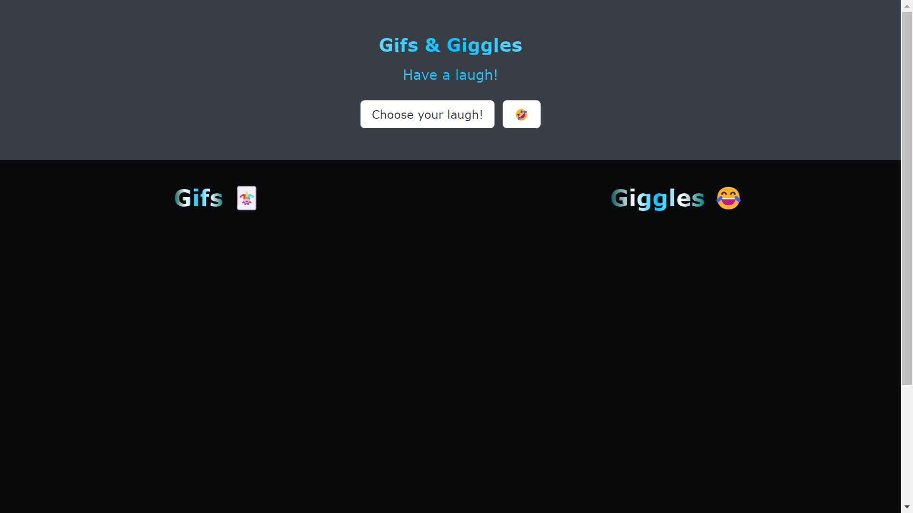
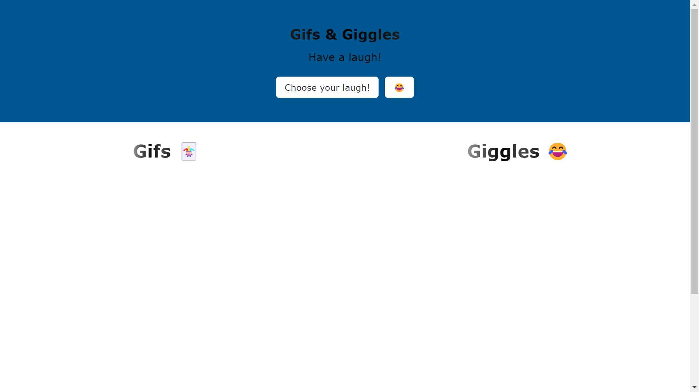
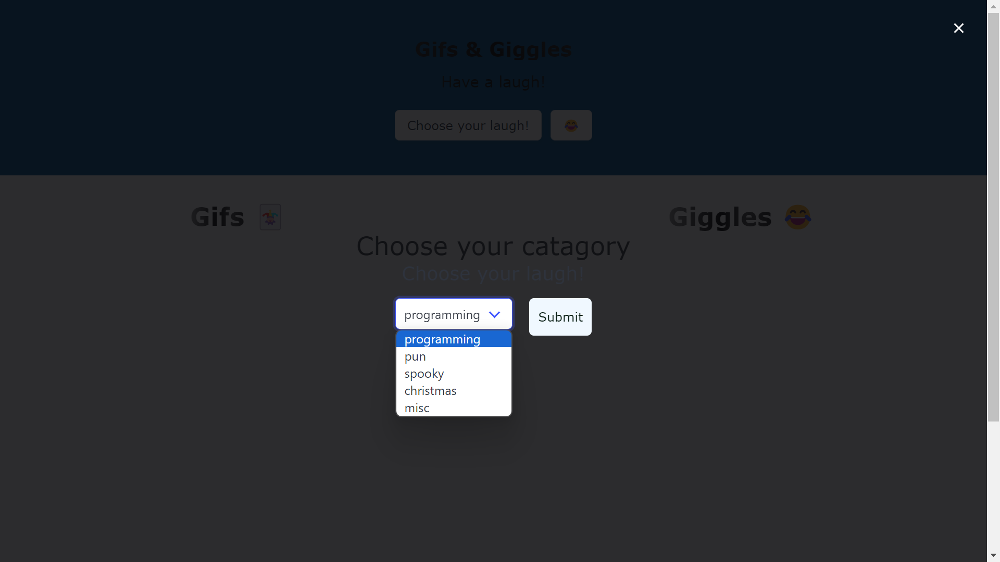
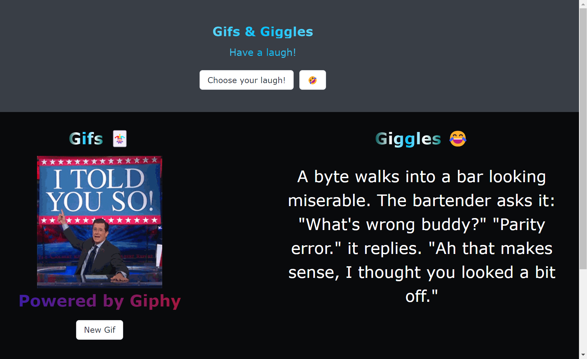

# Gifs and Giggles Webpapp

## Description

This is a webapp that allows users to choose a genre of jokes and gifs to be displayed. The user can choose to display a differnt gif by selecting the corresponding button below the Gif. The modalallows the user to choose between pun, christmas, programming, spooky, and misc.

## Installation

N/A

## Usage

To use Gifs and Giggles, the user should click the choose your laugh button in the head. This will launch the modal. Within the modal you can choose your genre from the dropdown box and click the submit button. This will generate the gif and a joke in the Gif and Giggle columns. The "new gif" button will allow the user to get a new random gif within the genre. The laughing icon image to the right of the Choose your laugh in the head will toggle between the light and dark mode options for the webapp. 

## Credits
Our awesome team consists of Erik Gontijo, Reyn Takahashi, Ronald aka "Paulee" Nelson, and Clifton Reed. 
Our gif API is provided by Giphy
https://ucbvirtfsfft0-zhg9511.slack.com/archives/C06RF8W5JM9/p1712342478979269

Our Joke API is provided by Joke API. 
https://sv443.net/jokeapi/v2/

## License

MIT License

Copyright (c) [2024] [Clifton Reed]

Permission is hereby granted, free of charge, to any person obtaining a copy
of this software and associated documentation files (the "Software"), to deal
in the Software without restriction, including without limitation the rights
to use, copy, modify, merge, publish, distribute, sublicense, and/or sell
copies of the Software, and to permit persons to whom the Software is
furnished to do so, subject to the following conditions:

The above copyright notice and this permission notice shall be included in all
copies or substantial portions of the Software.

THE SOFTWARE IS PROVIDED "AS IS", WITHOUT WARRANTY OF ANY KIND, EXPRESS OR
IMPLIED, INCLUDING BUT NOT LIMITED TO THE WARRANTIES OF MERCHANTABILITY,
FITNESS FOR A PARTICULAR PURPOSE AND NONINFRINGEMENT. IN NO EVENT SHALL THE
AUTHORS OR COPYRIGHT HOLDERS BE LIABLE FOR ANY CLAIM, DAMAGES OR OTHER
LIABILITY, WHETHER IN AN ACTION OF CONTRACT, TORT OR OTHERWISE, ARISING FROM,
OUT OF OR IN CONNECTION WITH THE SOFTWARE OR THE USE OR OTHER DEALINGS IN THE
SOFTWARE.  

---Images for referance---

 - darkmode landing 
 - light mode landing
 - modal interface
 - dark mode conclusion
 - light mode conclusion
